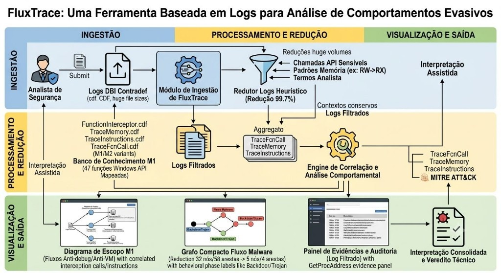
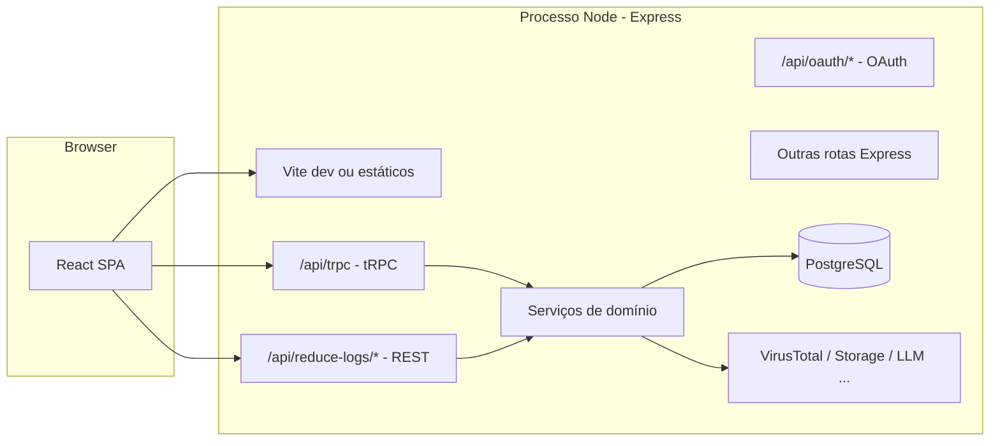

# Manual técnico — FluxTrace (sistema web)

Documento de referência para **desenvolvimento**, **operação** e **integração** com o FluxTrace. Mantém coerência com:

- [`readme-web.md`](../readme-web.md) — **único README do pacote** (frontend + backend + arranque)
- [`backend/.env.example`](../backend/.env.example) — variáveis de ambiente

**FluxTrace** é uma aplicação web para **correlação e rasto de fluxo** em logs no contexto Contradef: redução heurística de logs, visualização de fluxo, enriquecimento (ex.: MITRE ATT&CK, VirusTotal), e gestão de utilizadores e lotes de análise.

---

## 1. Visão geral da arquitectura

### 1.1. Pipeline funcional (visão do artigo)



| Fase | Componentes | Rotas / código |
|------|-------------|----------------|
| **Ingestão** | Analista → logs Contradef (`.cdf` / `.zip`) → módulo de ingestão → logs filtrados | UI `/reduce-logs`; handlers `reduceLogsUpload` |
| **Processamento e redução** | Redutor heurístico (ex.: **99,7%** no lote `49aa7438…`); banco M1 (47 APIs); agregador de `TraceFcnCall`, `TraceMemory`, `TraceInstructions`, `FunctionInterceptor`; engine de correlação | `backend/services/analysis/analysisService.ts` e serviços relacionados |
| **Visualização e saída** | Diagrama escopo M1; grafo compacto de fluxo (**32→5** nós, lote `db32e48a…`); painel de evidências; MITRE ATT&CK; interpretação consolidada e veredito técnico | `/funcoes-mapeadas`, `/funcoes-mapeadas/fluxo-malware`, `/interpretacao-consolidada` |

**Critérios do redutor heurístico:** chamadas de API sensíveis, padrões de memória (ex.: RW→RX), termos/gatilhos do analista e contexto mínimo (janelas e cabeçalhos).

### 1.2. Monólito “Node + SPA”

Um único processo **Express** (`backend/_core/server/index.ts`) serve:

- Em **desenvolvimento**: API + **Vite em modo middleware** (HMR, `setupVite` em `backend/_core/server/vite.ts`).
- Em **produção**: API + ficheiros estáticos gerados pelo build Vite (`serveStatic`, pasta `dist/public`).

O **browser** executa uma **SPA** React (entrada `frontend/index.html` → `src/app/main.tsx`). O cliente fala com o mesmo host sob caminhos relativos **`/api/...`** (sem CORS dedicado para API noutro domínio, por defeito).

### 1.3. Diagrama lógico (stack técnico)



### 1.4. Onde ficam os artefactos gerados

| Caminho (local) | Conteúdo |
|-----------------|----------|
| `CONTRADEF_REDUCE_LOGS_TMP/<SHA>/` | Upload multipart (**entrada**, temporário) |
| `CONTRADEF_WORK_TMP/<SHA>/` | Extração intermédia durante processamento |
| **`CONTRADEF_WORK_TMP/<batchId>/artifacts/reports/`** | **Saídas:** `reduced-logs.json`, `final-report.md`, `flow-graph.json`, `malware-flow-map.md` |

Por defeito no Windows (sem `.env`): `F:\contradef-tmp\…`. Com `.env` do projecto: `CONTRADEF_WORK_TMP=F:/contradef-tmp/analysis`.

Exportar para o repositório (evidências CTA):

```bash
cd fluxtrace_web
npx tsx backend/scripts/export-batch-artifacts.mts
```

Destino: `resultados/artefatos/<SHA-256>/reports/` (ver [`resultados/artefatos/README.md`](../../../resultados/artefatos/README.md)).

Com `CONTRADEF_DISCARD_ORIGINAL_LOGS_AFTER_SUCCESS=1`, os ficheiros em `artifacts/source/` (log bruto) são removidos após sucesso.

### 1.5. Organização do código (`fluxtrace_web/`)

| Pasta / ficheiro | Papel |
|------------------|--------|
| `package.json` | Dependências únicas do projeto; scripts `dev`, `build`, `check`, `test`, `db:push`, etc. |
| `.env` | **Não versionado.** Variáveis de servidor e `VITE_*`; modelo em `backend/.env.example`. |
| `frontend/` | Código cliente: React, Vite, Tailwind, shadcn, wouter. Ver [`readme-web.md`](../readme-web.md) (secção Frontend). |
| `backend/` | API Express, tRPC, Drizzle, modelos, serviços. Ver [`readme-web.md`](../readme-web.md) (secção Backend). |
| `dist/` | Saída de `pnpm build` (bundle do servidor + assets públicos). |
| `docs/` | Manuais versionados: `MANUAL-DEV-LOCAL.md`, `MANUAL-TECNICO.md`, `MANUAL-USUARIO.md`, `fluxtrace-arquitetura.png`. |

---

## 2. Frontend (resumo técnico)

### 2.1. Stack

React 19, TypeScript, Vite 7, Tailwind 4, shadcn/ui (Radix), **wouter**, **TanStack Query**, **tRPC v11**, **superjson**, i18next, Vitest. Configuração de build em `frontend/config/vite.config.ts`; testes em `frontend/config/vitest.config.ts`.

### 2.2. Aliases

Definidos em `frontend/tsconfig.json` (espelhados no Vite):

- `@/*` → `frontend/src/*`
- `@backend/*` → `backend/*`
- `@shared/*` → `backend/shared/*`

### 2.3. Rotas da SPA

Tabela **path → página** em [`readme-web.md`](../readme-web.md) (secção Frontend; fonte de verdade: `src/app/App.tsx`).

### 2.4. Comunicação com o backend

1. **tRPC** — `POST /api/trpc` (batch link), cookie `credentials: "include"`, transformer `superjson`. Cliente: `src/lib/api/trpc.ts` (`AppRouter` importado de `@backend/controllers/routers`).
2. **REST** — Uploads e fluxos pesados em `src/services/analysisService.ts`, rotas sob `/api/reduce-logs/...` (registo em `registerReduceLogsUploadRoute`).
3. **Tratamento de erros de auth** — `src/app/main.tsx` reage a `TRPCClientError` com mensagens partilhadas `@shared/const` (não autenticado, mudança de senha obrigatória).

---

## 3. Backend (resumo técnico)

### 3.1. Arranque e HTTP

- Entrada: `backend/_core/server/index.ts`.
- **Porta:** `PORT` (produção) ou detecção a partir de 3000 em desenvolvimento (ver função `findAvailablePort` no mesmo ficheiro).
- **Trust proxy** activado (`app.set("trust proxy", 1)`) para cookies `Secure` atrás de reverse proxy.
- **Body parser** até ~50 MB para metadados; uploads grandes usam multipart/chunked nas rotas dedicadas.

### 3.2. tRPC

- Router agregado: `backend/controllers/routers.ts` (`appRouter`).
- Middleware Express: `@trpc/server/adapters/express` em `/api/trpc`.
- Contexto por pedido: `backend/_core/server/context.ts` (sessão, utilizador).

### 3.3. Organização interna (MVC lógico)

Descrito em [`readme-web.md`](../readme-web.md) (secção Backend): `_core/server`, `_core/config`, `_core/postgres`, `_core/trpc`, `controllers/`, `models/`, `services/`, `shared/`, `drizzle/`, `scripts/`, `tests/`.

### 3.4. Base de dados

- **ORM:** Drizzle; esquema em `drizzle/schema/`.
- **Sincronização:** `pnpm db:push` na raiz (usa `backend/drizzle.config.ts`); no arranque pode correr push automático (desactivável com `SKIP_DB_AUTO_PUSH=1`) — ver `applyPostgresSchemaIfNeeded`.

### 3.5. Integrações relevantes

Variáveis e notas em [`readme-web.md`](../readme-web.md) (secção Backend) e `.env.example`:

- **PostgreSQL** — `DATABASE_URL`, `DATABASE_SSL` se necessário.
- **JWT / cookies** — `JWT_SECRET`, modos de auth em `AUTH_MODE` alinhado com `VITE_AUTH_MODE`.
- **OAuth WebDev / institucional** — `OAUTH_SERVER_URL`, `VITE_OAUTH_PORTAL_URL`, `VITE_APP_ID` (build + runtime).
- **OIDC (Google/Microsoft)** — `AUTH_MODE=oidc`, credenciais e `PUBLIC_APP_URL`.
- **VirusTotal** — `VIRUSTOTAL_API_KEY` **só no servidor** (nunca `VITE_`).
- **Storage / Forge / temporários** — ver [`readme-web.md`](../readme-web.md) (Backend) e `.env.example` (`CONTRADEF_*`).

---

## 4. Autenticação e autorização

### 4.1. Modos (`AUTH_MODE` / `VITE_AUTH_MODE`)

| Modo | Resumo |
|------|--------|
| `none` | Desenvolvimento: sem login formal; aviso no servidor em produção se usado. |
| `local` | Email + palavra-passe; registo; opcional OAuth WebDev com variáveis indicadas. |
| `webdev` | Fluxo template/WebDev com API OAuth. |
| `oidc` | Google / Microsoft conforme variáveis OIDC. |

**Regra:** `VITE_AUTH_MODE` deve **coincidir** com `AUTH_MODE` após **rebuild** do frontend (valores `VITE_*` embutidos no bundle).

### 4.2. Sessão

Cookies configurados em `backend/_core/config/cookies.ts` (ver também contexto tRPC). O cliente envia cookies em chamadas `fetch` / tRPC com `credentials: "include"`.

### 4.3. Administração

- Semente opcional: `DEFAULT_LOCAL_ADMIN_EMAIL` / `DEFAULT_LOCAL_ADMIN_PASSWORD` com `AUTH_MODE=local`.
- UI de administração de utilizadores: rota `/admin/usuarios` (permissões efectivas dependem das procedures tRPC de admin).

---

## 5. Domínio funcional (visão técnica)

### 5.1. Lotes / batches e análise

Modelos e repositórios em `backend/models/`; lógica em `backend/services/analysis/` e routers em `backend/controllers/analysis/`. Tipos e schemas Zod partilhados em `backend/shared/analysis/`.

### 5.2. Redução de logs

- UI: `frontend/src/pages/reduce-logs/ReduceLogs.tsx`.
- Monitorização cliente: `reduceLogsMonitor.ts`; uploads via `analysisService.ts` e handlers `reduceLogsUpload`.
- Export Excel / sessão / debug: `frontend/src/lib/reduce-logs/*`.

### 5.3. Interpretação consolidada e fluxo

- Gráficos de fluxo (`@xyflow/react`, construção em `lib/analysis/flowGraph` e componentes `components/flow/`).
- Painéis MITRE / VirusTotal: componentes sob `components/mitre/`, `components/virus-total/`.

### 5.4. Funções mapeadas

Página `FuncoesMapeadas.tsx`; integração com dados de análise via tRPC (detalhe nos controladores `analysis`).

---

## 6. Build e execução

### 6.1. Desenvolvimento

Na raiz `fluxtrace_web/`:

```bash
pnpm install
pnpm dev
```

Arranca `tsx watch backend/_core/server/index.ts` com Vite integrado.

### 6.2. Build de produção

```bash
pnpm build
```

Compila o frontend (`vite build --config frontend/config/vite.config.ts`) e empacota o entrypoint do servidor para `dist/index.js`. Execução típica: `pnpm start` → `node dist/index.js`.

### 6.3. Typecheck e testes

- `pnpm check` — `tsc` frontend + backend.
- `pnpm test` — Vitest frontend (`frontend/config/vitest.config.ts`) + backend (`backend/vitest.config.ts`).

---

## 7. Testes e convenções

| Área | Convenção (resumo) |
|------|---------------------|
| Backend | Testes colocalizados em `services/`, `controllers/`, `models/`; pasta `backend/tests/` para cortes transversais — ver [`readme-web.md`](../readme-web.md) ou o código. |
| Frontend | `*.test.ts(x)` junto ao código; Vitest com `jsdom` onde necessário. |

---

## 8. Segurança e boas práticas

- Não comitar **`.env`** com segredos; usar `backend/.env.example` como referência.
- Chaves **apenas de servidor** (JWT, VirusTotal, segredos OAuth) **sem** prefixo `VITE_`.
- Após alterar **`VITE_*`**, gerar **novo build** do frontend.
- Em produção, evitar `AUTH_MODE=none` se a política exigir autenticação real.

---

## 9. Deploy (produção)

Checklist detalhada no **Deploy no Render** em [`readme-web.md`](../readme-web.md) (secção Backend).

---

## 10. Manutenção e scripts CLI

Tabela de scripts em [`readme-web.md`](../readme-web.md) (secção Backend).

---

## 11. Referência cruzada de documentos

| Tema | Onde aprofundar |
|------|------------------|
| Rotas e pastas do cliente | [`readme-web.md`](../readme-web.md) — secção Frontend |
| Drizzle, BD, routers servidor | [`readme-web.md`](../readme-web.md) — secção Backend |
| Ambiente local, VS Code, Postgres, primeiro arranque | [`MANUAL-DEV-LOCAL.md`](./MANUAL-DEV-LOCAL.md) |
| Utilização pelos utilizadores | [`MANUAL-USUARIO.md`](./MANUAL-USUARIO.md) |
| Variáveis linha-a-linha comentadas | `backend/.env.example` |
| Documentação única do pacote npm | [`readme-web.md`](../readme-web.md) |

---

## 12. Nota de versão deste manual

Este texto foi elaborado para reflectir a estrutura do repositório **após reorganização** de `frontend/` (`config/`, `src/app`, `pages` por domínio, `lib` segmentado). Se mudar rotas, variáveis críticas ou o arranque do servidor, actualize **este ficheiro** em paralelo com [`readme-web.md`](../readme-web.md) para manter uma única história coerente.
