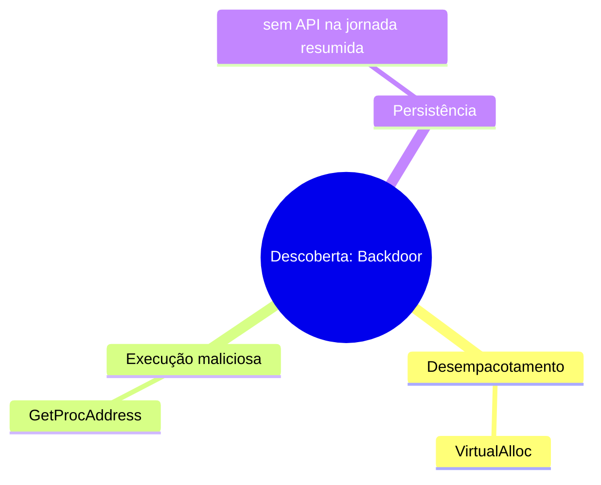

# Mapa do fluxo do malware

> Gerado automaticamente a partir do grafo de correlação (`reports/flow-graph.json`). **Classificação:** Backdoor.
> **Amostra:** Redução Logs FluxTrace - 1db3df87facac7ad4bf2fc7f9c49392f6f1cd69ce3d5db0d7b1a23074ad0dd69.
> Visualize com suporte a [Mermaid](https://mermaid.js.org/) (VS Code, GitHub, Obsidian) ou copie cada bloco para [mermaid.live](https://mermaid.live).

## 1. Diagrama dirigido (fases, jornada e veredito)

```mermaid
flowchart TB
  classDef phase fill:#1e3a5f,stroke:#60a5fa,color:#e0f2fe;
  classDef api fill:#14532d,stroke:#4ade80,color:#dcfce7;
  classDef verdict fill:#4c1d95,stroke:#c084fc,color:#f3e8ff;
  n_phase_Desempacotamento["Desempacotamento"]
  n_phase_Execu_o_maliciosa["Execução maliciosa"]
  n_phase_Persist_ncia["Persistência"]
  n_event_0_GetProcAddress("GetProcAddress")
  n_event_1_GetProcAddress("GetProcAddress")
  n_event_2_GetProcAddress("GetProcAddress")
  n_event_3_GetProcAddress("GetProcAddress")
  n_event_4_GetProcAddress("GetProcAddress")
  n_event_5_GetProcAddress("GetProcAddress")
  n_event_6_GetProcAddress("GetProcAddress")
  n_event_7_GetProcAddress("GetProcAddress")
  n_event_8_GetProcAddress("GetProcAddress")
  n_event_9_GetProcAddress("GetProcAddress")
  n_event_10_GetProcAddress("GetProcAddress")
  n_event_11_GetProcAddress("GetProcAddress")
  n_event_12_VirtualAlloc("VirtualAlloc")
  n_event_13_VirtualAlloc("VirtualAlloc")
  n_event_14_VirtualAlloc("VirtualAlloc")
  n_event_15_VirtualAlloc("VirtualAlloc")
  n_event_16_VirtualAlloc("VirtualAlloc")
  n_event_17_VirtualAlloc("VirtualAlloc")
  n_event_18_VirtualAlloc("VirtualAlloc")
  n_event_19_VirtualAlloc("VirtualAlloc")
  n_event_20_VirtualAlloc("VirtualAlloc")
  n_event_21_VirtualAlloc("VirtualAlloc")
  n_event_22_VirtualAlloc("VirtualAlloc")
  n_event_23_VirtualAlloc("VirtualAlloc")
  n_event_24_VirtualAlloc("VirtualAlloc")
  n_event_25_VirtualAlloc("VirtualAlloc")
  n_event_26_VirtualAlloc("VirtualAlloc")
  n_event_27_VirtualAlloc("VirtualAlloc")
  n_verdict_discovery{{"Descoberta: Backdoor"}}
  class n_phase_Desempacotamento,n_phase_Execu_o_maliciosa,n_phase_Persist_ncia phase;
  class n_event_0_GetProcAddress,n_event_1_GetProcAddress,n_event_2_GetProcAddress,n_event_3_GetProcAddress,n_event_4_GetProcAddress,n_event_5_GetProcAddress,n_event_6_GetProcAddress,n_event_7_GetProcAddress,n_event_8_GetProcAddress,n_event_9_GetProcAddress,n_event_10_GetProcAddress,n_event_11_GetProcAddress,n_event_12_VirtualAlloc,n_event_13_VirtualAlloc,n_event_14_VirtualAlloc,n_event_15_VirtualAlloc,n_event_16_VirtualAlloc,n_event_17_VirtualAlloc,n_event_18_VirtualAlloc,n_event_19_VirtualAlloc,n_event_20_VirtualAlloc,n_event_21_VirtualAlloc,n_event_22_VirtualAlloc,n_event_23_VirtualAlloc,n_event_24_VirtualAlloc,n_event_25_VirtualAlloc,n_event_26_VirtualAlloc,n_event_27_VirtualAlloc api;
  class n_verdict_discovery verdict;
  n_phase_Desempacotamento -->|"evolui para"| n_phase_Execu_o_maliciosa
  n_phase_Execu_o_maliciosa -->|"evolui para"| n_phase_Persist_ncia
  n_phase_Execu_o_maliciosa -->|"evidência"| n_event_0_GetProcAddress
  n_phase_Execu_o_maliciosa -->|"evidência"| n_event_1_GetProcAddress
  n_event_0_GetProcAddress -->|"progressão da execução"| n_event_1_GetProcAddress
  n_phase_Execu_o_maliciosa -->|"evidência"| n_event_2_GetProcAddress
  n_event_1_GetProcAddress -->|"progressão da execução"| n_event_2_GetProcAddress
  n_phase_Execu_o_maliciosa -->|"evidência"| n_event_3_GetProcAddress
  n_event_2_GetProcAddress -->|"progressão da execução"| n_event_3_GetProcAddress
  n_phase_Execu_o_maliciosa -->|"evidência"| n_event_4_GetProcAddress
  n_event_3_GetProcAddress -->|"progressão da execução"| n_event_4_GetProcAddress
  n_phase_Execu_o_maliciosa -->|"evidência"| n_event_5_GetProcAddress
  n_event_4_GetProcAddress -->|"progressão da execução"| n_event_5_GetProcAddress
  n_phase_Execu_o_maliciosa -->|"evidência"| n_event_6_GetProcAddress
  n_event_5_GetProcAddress -->|"progressão da execução"| n_event_6_GetProcAddress
  n_phase_Execu_o_maliciosa -->|"evidência"| n_event_7_GetProcAddress
  n_event_6_GetProcAddress -->|"progressão da execução"| n_event_7_GetProcAddress
  n_phase_Execu_o_maliciosa -->|"evidência"| n_event_8_GetProcAddress
  n_event_7_GetProcAddress -->|"progressão da execução"| n_event_8_GetProcAddress
  n_phase_Execu_o_maliciosa -->|"evidência"| n_event_9_GetProcAddress
  n_event_8_GetProcAddress -->|"progressão da execução"| n_event_9_GetProcAddress
  n_phase_Execu_o_maliciosa -->|"evidência"| n_event_10_GetProcAddress
  n_event_9_GetProcAddress -->|"progressão da execução"| n_event_10_GetProcAddress
  n_phase_Execu_o_maliciosa -->|"evidência"| n_event_11_GetProcAddress
  n_event_10_GetProcAddress -->|"progressão da execução"| n_event_11_GetProcAddress
  n_phase_Desempacotamento -->|"evidência"| n_event_12_VirtualAlloc
  n_event_11_GetProcAddress -->|"preparação de memória"| n_event_12_VirtualAlloc
  n_phase_Desempacotamento -->|"evidência"| n_event_13_VirtualAlloc
  n_event_12_VirtualAlloc -->|"preparação de memória"| n_event_13_VirtualAlloc
  n_phase_Desempacotamento -->|"evidência"| n_event_14_VirtualAlloc
  n_event_13_VirtualAlloc -->|"preparação de memória"| n_event_14_VirtualAlloc
  n_phase_Desempacotamento -->|"evidência"| n_event_15_VirtualAlloc
  n_event_14_VirtualAlloc -->|"preparação de memória"| n_event_15_VirtualAlloc
  n_phase_Desempacotamento -->|"evidência"| n_event_16_VirtualAlloc
  n_event_15_VirtualAlloc -->|"preparação de memória"| n_event_16_VirtualAlloc
  n_phase_Desempacotamento -->|"evidência"| n_event_17_VirtualAlloc
  n_event_16_VirtualAlloc -->|"preparação de memória"| n_event_17_VirtualAlloc
  n_phase_Desempacotamento -->|"evidência"| n_event_18_VirtualAlloc
  n_event_17_VirtualAlloc -->|"preparação de memória"| n_event_18_VirtualAlloc
  n_phase_Desempacotamento -->|"evidência"| n_event_19_VirtualAlloc
  n_event_18_VirtualAlloc -->|"preparação de memória"| n_event_19_VirtualAlloc
  n_phase_Desempacotamento -->|"evidência"| n_event_20_VirtualAlloc
  n_event_19_VirtualAlloc -->|"preparação de memória"| n_event_20_VirtualAlloc
  n_phase_Desempacotamento -->|"evidência"| n_event_21_VirtualAlloc
  n_event_20_VirtualAlloc -->|"preparação de memória"| n_event_21_VirtualAlloc
  n_phase_Desempacotamento -->|"evidência"| n_event_22_VirtualAlloc
  n_event_21_VirtualAlloc -->|"preparação de memória"| n_event_22_VirtualAlloc
  n_phase_Desempacotamento -->|"evidência"| n_event_23_VirtualAlloc
  n_event_22_VirtualAlloc -->|"preparação de memória"| n_event_23_VirtualAlloc
  n_phase_Desempacotamento -->|"evidência"| n_event_24_VirtualAlloc
  n_event_23_VirtualAlloc -->|"preparação de memória"| n_event_24_VirtualAlloc
  n_phase_Desempacotamento -->|"evidência"| n_event_25_VirtualAlloc
  n_event_24_VirtualAlloc -->|"preparação de memória"| n_event_25_VirtualAlloc
  n_phase_Desempacotamento -->|"evidência"| n_event_26_VirtualAlloc
  n_event_25_VirtualAlloc -->|"preparação de memória"| n_event_26_VirtualAlloc
  n_phase_Desempacotamento -->|"evidência"| n_event_27_VirtualAlloc
  n_event_26_VirtualAlloc -->|"preparação de memória"| n_event_27_VirtualAlloc
  n_event_27_VirtualAlloc -->|"leva ao veredito"| n_verdict_discovery
```

## 2. Mapa mental (fases e APIs da jornada)

