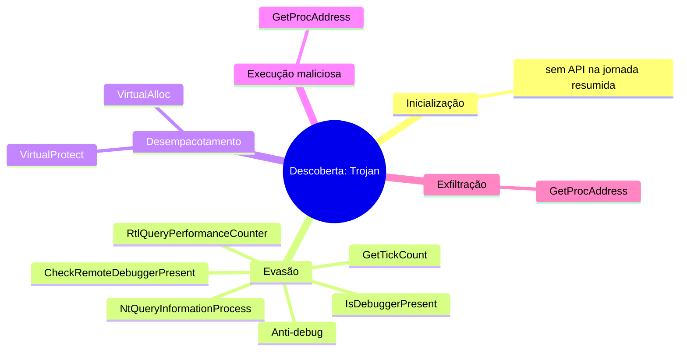

# Mapa do fluxo do malware

> Gerado automaticamente a partir do grafo de correlação (`reports/flow-graph.json`). **Classificação:** Trojan.
> **Amostra:** Redução Logs Contradef.
> Visualize com suporte a [Mermaid](https://mermaid.js.org/) (VS Code, GitHub, Obsidian) ou copie cada bloco para [mermaid.live](https://mermaid.live).

## 1. Diagrama dirigido (fases, jornada e veredito)

```mermaid
flowchart TB
  classDef phase fill:#1e3a5f,stroke:#60a5fa,color:#e0f2fe;
  classDef api fill:#14532d,stroke:#4ade80,color:#dcfce7;
  classDef verdict fill:#4c1d95,stroke:#c084fc,color:#f3e8ff;
  n_phase_Inicializa_o["Inicialização"]
  n_phase_Evas_o["Evasão"]
  n_phase_Desempacotamento["Desempacotamento"]
  n_phase_Execu_o_maliciosa["Execução maliciosa"]
  n_phase_Exfiltra_o["Exfiltração"]
  n_event_0_IsDebuggerPresent("IsDebuggerPresent")
  n_event_1_CheckRemoteDebuggerPresent("CheckRemoteDebuggerPresent")
  n_event_2_Anti_debug("Anti-debug")
  n_event_3_NtQueryInformationProcess("NtQueryInformationProcess")
  n_event_4_NtQueryInformationProcess("NtQueryInformationProcess")
  n_event_5_NtQueryInformationProcess("NtQueryInformationProcess")
  n_event_6_NtQueryInformationProcess("NtQueryInformationProcess")
  n_event_7_VirtualProtect("VirtualProtect")
  n_event_8_VirtualProtect("VirtualProtect")
  n_event_9_VirtualProtect("VirtualProtect")
  n_event_10_VirtualProtect("VirtualProtect")
  n_event_11_GetTickCount("GetTickCount")
  n_event_12_RtlQueryPerformanceCounter("RtlQueryPerformanceCounter")
  n_event_13_RtlQueryPerformanceCounter("RtlQueryPerformanceCounter")
  n_event_14_RtlQueryPerformanceCounter("RtlQueryPerformanceCounter")
  n_event_15_VirtualProtect("VirtualProtect")
  n_event_16_IsDebuggerPresent("IsDebuggerPresent")
  n_event_17_VirtualAlloc("VirtualAlloc")
  n_event_18_VirtualAlloc("VirtualAlloc")
  n_event_19_VirtualAlloc("VirtualAlloc")
  n_event_20_VirtualAlloc("VirtualAlloc")
  n_event_21_GetProcAddress("GetProcAddress")
  n_event_22_GetProcAddress("GetProcAddress")
  n_event_23_GetProcAddress("GetProcAddress")
  n_event_24_GetProcAddress("GetProcAddress")
  n_event_25_GetProcAddress("GetProcAddress")
  n_event_26_GetProcAddress("GetProcAddress")
  n_event_27_GetProcAddress("GetProcAddress")
  n_verdict_discovery{{"Descoberta: Trojan"}}
  class n_phase_Inicializa_o,n_phase_Evas_o,n_phase_Desempacotamento,n_phase_Execu_o_maliciosa,n_phase_Exfiltra_o phase;
  class n_event_0_IsDebuggerPresent,n_event_1_CheckRemoteDebuggerPresent,n_event_2_Anti_debug,n_event_3_NtQueryInformationProcess,n_event_4_NtQueryInformationProcess,n_event_5_NtQueryInformationProcess,n_event_6_NtQueryInformationProcess,n_event_7_VirtualProtect,n_event_8_VirtualProtect,n_event_9_VirtualProtect,n_event_10_VirtualProtect,n_event_11_GetTickCount,n_event_12_RtlQueryPerformanceCounter,n_event_13_RtlQueryPerformanceCounter,n_event_14_RtlQueryPerformanceCounter,n_event_15_VirtualProtect,n_event_16_IsDebuggerPresent,n_event_17_VirtualAlloc,n_event_18_VirtualAlloc,n_event_19_VirtualAlloc,n_event_20_VirtualAlloc,n_event_21_GetProcAddress,n_event_22_GetProcAddress,n_event_23_GetProcAddress,n_event_24_GetProcAddress,n_event_25_GetProcAddress,n_event_26_GetProcAddress,n_event_27_GetProcAddress api;
  class n_verdict_discovery verdict;
  n_phase_Inicializa_o -->|"evolui para"| n_phase_Evas_o
  n_phase_Evas_o -->|"evolui para"| n_phase_Desempacotamento
  n_phase_Desempacotamento -->|"evolui para"| n_phase_Execu_o_maliciosa
  n_phase_Execu_o_maliciosa -->|"evolui para"| n_phase_Exfiltra_o
  n_phase_Evas_o -->|"evidência"| n_event_0_IsDebuggerPresent
  n_phase_Evas_o -->|"evidência"| n_event_1_CheckRemoteDebuggerPresent
  n_event_0_IsDebuggerPresent -->|"checagem anti-debug"| n_event_1_CheckRemoteDebuggerPresent
  n_phase_Evas_o -->|"evidência"| n_event_2_Anti_debug
  n_event_1_CheckRemoteDebuggerPresent -->|"progressão da execução"| n_event_2_Anti_debug
  n_phase_Evas_o -->|"evidência"| n_event_3_NtQueryInformationProcess
  n_event_2_Anti_debug -->|"checagem anti-debug"| n_event_3_NtQueryInformationProcess
  n_phase_Evas_o -->|"evidência"| n_event_4_NtQueryInformationProcess
  n_event_3_NtQueryInformationProcess -->|"checagem anti-debug"| n_event_4_NtQueryInformationProcess
  n_phase_Evas_o -->|"evidência"| n_event_5_NtQueryInformationProcess
  n_event_4_NtQueryInformationProcess -->|"checagem anti-debug"| n_event_5_NtQueryInformationProcess
  n_phase_Evas_o -->|"evidência"| n_event_6_NtQueryInformationProcess
  n_event_5_NtQueryInformationProcess -->|"checagem anti-debug"| n_event_6_NtQueryInformationProcess
  n_phase_Desempacotamento -->|"evidência"| n_event_7_VirtualProtect
  n_event_6_NtQueryInformationProcess -->|"transição RW->RX (unpacking)"| n_event_7_VirtualProtect
  n_phase_Desempacotamento -->|"evidência"| n_event_8_VirtualProtect
  n_event_7_VirtualProtect -->|"transição RW->RX (unpacking)"| n_event_8_VirtualProtect
  n_phase_Desempacotamento -->|"evidência"| n_event_9_VirtualProtect
  n_event_8_VirtualProtect -->|"transição RW->RX (unpacking)"| n_event_9_VirtualProtect
  n_phase_Desempacotamento -->|"evidência"| n_event_10_VirtualProtect
  n_event_9_VirtualProtect -->|"transição RW->RX (unpacking)"| n_event_10_VirtualProtect
  n_phase_Evas_o -->|"evidência"| n_event_11_GetTickCount
  n_event_10_VirtualProtect -->|"checagem anti-overhead"| n_event_11_GetTickCount
  n_phase_Evas_o -->|"evidência"| n_event_12_RtlQueryPerformanceCounter
  n_event_11_GetTickCount -->|"checagem anti-overhead"| n_event_12_RtlQueryPerformanceCounter
  n_phase_Evas_o -->|"evidência"| n_event_13_RtlQueryPerformanceCounter
  n_event_12_RtlQueryPerformanceCounter -->|"checagem anti-overhead"| n_event_13_RtlQueryPerformanceCounter
  n_phase_Evas_o -->|"evidência"| n_event_14_RtlQueryPerformanceCounter
  n_event_13_RtlQueryPerformanceCounter -->|"checagem anti-overhead"| n_event_14_RtlQueryPerformanceCounter
  n_phase_Desempacotamento -->|"evidência"| n_event_15_VirtualProtect
  n_event_14_RtlQueryPerformanceCounter -->|"transição RW->RX (unpacking)"| n_event_15_VirtualProtect
  n_phase_Evas_o -->|"evidência"| n_event_16_IsDebuggerPresent
  n_event_15_VirtualProtect -->|"checagem anti-debug"| n_event_16_IsDebuggerPresent
  n_phase_Desempacotamento -->|"evidência"| n_event_17_VirtualAlloc
  n_event_16_IsDebuggerPresent -->|"preparação de memória"| n_event_17_VirtualAlloc
  n_phase_Desempacotamento -->|"evidência"| n_event_18_VirtualAlloc
  n_event_17_VirtualAlloc -->|"preparação de memória"| n_event_18_VirtualAlloc
  n_phase_Desempacotamento -->|"evidência"| n_event_19_VirtualAlloc
  n_event_18_VirtualAlloc -->|"preparação de memória"| n_event_19_VirtualAlloc
  n_phase_Desempacotamento -->|"evidência"| n_event_20_VirtualAlloc
  n_event_19_VirtualAlloc -->|"preparação de memória"| n_event_20_VirtualAlloc
  n_phase_Execu_o_maliciosa -->|"evidência"| n_event_21_GetProcAddress
  n_event_20_VirtualAlloc -->|"progressão da execução"| n_event_21_GetProcAddress
  n_phase_Execu_o_maliciosa -->|"evidência"| n_event_22_GetProcAddress
  n_event_21_GetProcAddress -->|"progressão da execução"| n_event_22_GetProcAddress
  n_phase_Exfiltra_o -->|"evidência"| n_event_23_GetProcAddress
  n_event_22_GetProcAddress -->|"progressão da execução"| n_event_23_GetProcAddress
  n_phase_Execu_o_maliciosa -->|"evidência"| n_event_24_GetProcAddress
  n_event_23_GetProcAddress -->|"progressão da execução"| n_event_24_GetProcAddress
  n_phase_Execu_o_maliciosa -->|"evidência"| n_event_25_GetProcAddress
  n_event_24_GetProcAddress -->|"progressão da execução"| n_event_25_GetProcAddress
  n_phase_Execu_o_maliciosa -->|"evidência"| n_event_26_GetProcAddress
  n_event_25_GetProcAddress -->|"progressão da execução"| n_event_26_GetProcAddress
  n_phase_Execu_o_maliciosa -->|"evidência"| n_event_27_GetProcAddress
  n_event_26_GetProcAddress -->|"progressão da execução"| n_event_27_GetProcAddress
  n_event_27_GetProcAddress -->|"leva ao veredito"| n_verdict_discovery
```

## 2. Mapa mental (fases e APIs da jornada)

